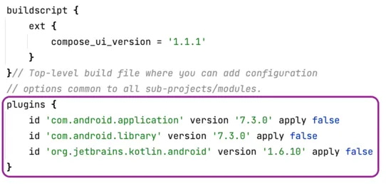
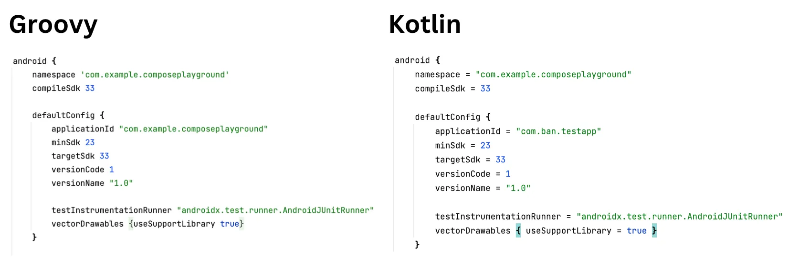
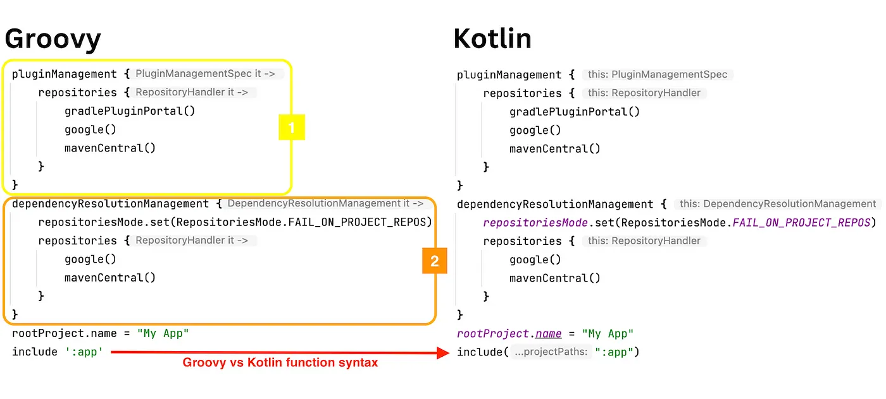
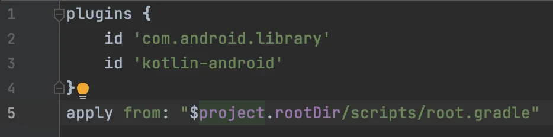

# All You Need In Android

"All You Need In Android" is a comprehensive project designed to serve as a one-stop resource for Android developers, encompassing a wide array of topics, technologies, and best practices in accordance with the latest guidelines from Google's Android Developer platform.

This project is meticulously crafted to cover every facet of Android development, ensuring that developers of all levels find valuable insights, examples, and implementations to enhance their skills and stay abreast of the ever-evolving Android ecosystem.


## Features

- Clean Architecture
- Modularization
- Gradle Convention Plugins

<br/>
<br/>

> **_NOTE:_**  We will be discussing every topic of Android SDK in terms of [Android Jetpack](https://developer.android.com/jetpack), [Kotlin](https://kotlinlang.org/).

## Architecture

Before starting any project we should keep in mind the following things that are most important,

  - Scalability
  - Maintainability 
  - Reusability
  - Extensibility
  - Testability

Keeping these aspects of a well-structured software project there are some architectural principles that any project should follow. For Android the following principles should be followed:

#### [Separation of concern](https://developer.android.com/topic/architecture#separation-of-concerns)

Make fatty Activity or Fragment as lean as possible so that we can minimize dependency on them.

#### [Drive UI from data models](https://developer.android.com/topic/architecture#drive-ui-from-model)

Drive UI from persistent data models to prevent data loss, ensure functionality during network issues, and enhance testability and robustness.

#### [Single source of truth](https://developer.android.com/topic/architecture#single-source-of-truth)

Assign a Single Source of Truth (SSOT) to each new data type in your app. The SSOT, which owns and controls the data, exposes it through immutable types and functions/events for modification. Benefits include centralized data changes, data protection, and improved bug tracing. In offline-first apps, the database is often the SSOT; in other cases, it could be a ViewModel or UI.


```kotlin
ViewModel.kt
private val _searchQuery:MutableStateFlow<String?> = MutableStateFlow(null)
val searchQuery = _searchQuery.asStateFlow()

fun onSearchQuery(query: String) {
    viewModelScope.launch {
        _searchQuery.emit(query)
    }
}

```

#### [Unidirectional Data Flow](https://developer.android.com/topic/architecture#unidirectional-data-flow)

UDF, combined with the SSOT principle, ensures one-way data flow in Android apps, from higher to lower-scoped types. This promotes data consistency, reduces errors, simplifies debugging, and leverages SSOT benefits.


## Modularization

Modularization is a practice of organizing a codebase into loosely coupled and self contained parts. Each part is a module. 
Each module is independent and serves a clear purpose. By dividing a problem into smaller and easier to solve subproblems, 
you reduce the complexity of designing and maintaining a large system.


#### Benefits of modularization 

|          Benefit           |                                                                                            Summary                                                                                             |
|:--------------------------:|:----------------------------------------------------------------------------------------------------------------------------------------------------------------------------------------------:|
|        Reliability         |  Modularization allows code sharing and creating multiple apps from one foundation. Apps are composed of separate feature modules, each potentially enabled or disabled based on app variants  |
| Strict visibility control  |                         Modules provide control over code exposure, allowing marking internal details to prevent external usage, while maintaining a public interface.                         |
|   Customizable delivery    |                [Play Feature Delivery](https://developer.android.com/guide/playcore/feature-delivery) utilizes app bundles to deliver app features conditionally or on demand.                 |
|        Scalability         |                                       A properly modularized project will embrace the separation of concerns principle and therefore limit the coupling                                        | 
|         Ownership          |                               A module can have a dedicated owner who is responsible for maintaining the code, fixing bugs, adding tests, and reviewing changes.                               |
|       Encapsulation        |                          each part of your code should have the smallest possible amount of knowledge about other parts so that ir is easier to read and understand.                           |
|        Testability         |                                                           A testable code is one where components can be easily tested in isolation.                                                           | 
|         Build time         |               incremental build, build cache or parallel build, can leverage modularity to [improve build performance](https://developer.android.com/build/optimize-your-build).               |


> #### Pitfalls 
> Too fine-grained : Every module comes with a certain overhead due to complex build configuration . we should consider minimizing overhead by consolidating modules for better scalability and maintainability
> 
> Too coarse-grained : Conversely , we should maintain modularity to avoid yet another overly large modules or monolith structure
> 
> Too complex : Modularizing a project may not be necessary if the codebase is small and not expected to grow significantly


## Gradle Convention Plugins

Before diving into a powerful tool Gradle Convention Plugins, we will understand what is Gradle and how it works .

### Gradle

Gradle is a build tool that we use for Android development to automate the process of building and publishing apps.
An advantage of using Gradle is that it can run independently of Android Studio. You do not need Android Studio at all to generate APKs.
Before jumping into the depth of gradle we will learn about process of compiling Android with kotlin/java code.

```
How android compiling Android with Kotlin/Java code

    1. xyz.java or xyz.kt file is compiled by javac or kotlinc respectfully
    2. javac / kotlinc compiles java/kotlin source file into java byte-code file as xyz.class
    3. java byte code are converted into Dalvic byte-code using DX(Dex compiler) as 
       a file named xyz.dex
    4. DVM/ART understands Dalvic byte-code and converts it into machine code, 
       using JIT(Just-In-Time)/AOT(Ahead-Of_Time) compiler
    5. The machine code is then fed to the memory and executed by computer’s central processing unit.

ART (Android Runtime) — introduced with the release of Android 4.4 (Kitkat), and before it the runtime environment 
for Android apps was DVM.ART compiles .dex files using on-device dex20at tool at its installation so that 
it does not compile every time app is started.
```

These are the general steps that happen when we press Run button:

    1. Gradle reads the app’s build configuration file (build.gradle) which contains information about the dependencies, build types, etc.
    2. Gradle downloads and resolves the app’s dependencies.
    3. Gradle compiles the app’s code, which includes converting the Java or Kotlin code into bytecode.
    4. After that, Gradle packs the compiled code and resources into an APK file.
    5. Finally, Gradle installs the APK file on the device or emulator and runs the app.

> It provides its own domain-specific language (DSL), which is a type of programming language that is tailored to a build automation domain, and it is based on Groovy or Kotlin for describing build scripts.

#### build.gradle (project)



The project-level build.gradle file is used to define global configuration and settings for the entire project.
It is also used to implement dependencies and plugins on top level. 
By default, all configurations and settings inside our project-level build.gradle should be inherited by all the modules in the project, 
and build.gradle files inside modules are able to override them.

At the top, we have a optional buildscript and ext functions that are used for setting up our global values that we would like to use in build.gradle files inside our modules.
the plugins method, which enables defining core plugins required for the project.
The syntax for defining plugins involves using the id function to specify the plugin's package name and then setting its version.
he apply keyword is also used to configure the plugin. When set to true, the plugin configuration is applied immediately, 
whereas setting it to false defers the configuration to a later stage.

#### build.gradle (app)



It is used for defining the configurations and settings used for this particular module. 
Functionality-wise, it has similar options as project-level build.gradle, but it brings a separation of concerns. 
So all the libraries and frameworks, that we want to use in our Kotlin code that is placed inside our app module, 
should be defined in dependencies block from this gradle file. All the plugins that are required for these 
libraries to work should also be defined in the same gradle file.

In android function we can set The versions of minSdk, targetSdk and compileSdk, Version code and name of the app, Product flavors and build types. 
The configurations are given below

|    Configurations    | Description                                                                                                                                                                                                                           |
|:--------------------:|:--------------------------------------------------------------------------------------------------------------------------------------------------------------------------------------------------------------------------------------|
|     Build Types      | We can define build types under the buildType block, eg. debug, release, staging etc. We can configurations specific to build types here such as signingConfigs, proguard file etc.                                                   |
|   Product Flavors    | They’re defined under the productFlavor block, eg dev, prod etc. We can define configuration specific to flavor here such as flavor specific manifest placeholders, build config fields etc                                           |
|    Build Variants    | These are created implicitly by gradle and is a combination of build types and flavor. Ex: the above configurations will yeild devDebug, devProd, devStaging, prodDebug, prodRelease and prodStaging.                                 |
|  Manifest Injection  | We can assign values to the AndroidManifest.xml file from gradle using manifestPlaceholder array.                                                                                                                                     |
|     Build Config     | We can also declare certain values in a module’s gradle file which will be present as a static reference to the module after the build is done. A BuildConfig java class would be created which will hold all the build config files. |
|     Dependencies     | You must be familiar with this. We can declare dependencies to local / remote repositories here using api or implementation keyword. They can be specific to build variants as well, ex devImplementation or prodImplementation.      |
|       Signing        | Gradle can help automatically sign the apk during build process based on the defined configuration.                                                                                                                                   |
|    Code Shrinking    | Gradle uses R8 to shrink and obfuscate code based on the rules specified in the proguard file.                                                                                                                                        |
| Multiple APK Support | We can leverage gradle to create multiple APK for specific screen density etc.                                                                                                                                                        |


#### settings.gradle



As we can see there are two main sections inside it:

    1.Plugin management: The pluginManagement lambda function provides PluginManagementSpec argument which is accessible.
    within PluginManagementSpec we can find a function called repositories that provides a RepositoryHandler argument.
    This is the place we pass the list of our repositories where Gradle will try to find plugins and it will download the ones it finds.
    2.Dependency resolution management: It doues the similar thing as the pluginManagement one, but it provides the list of repositories where Gradle will search
    for dependencies that are necessary for our project.

> Dependencies: Dependencies are all those third party libraries that we can use in our Kotlin code when developing our apps.
> Plugins: Plugins provide all the tasks (functions) that Gradle is using when building our projects. So it is basically a third party library for our gradle files.


#### Import Other Gradle Scripts




## Authors

- [Akash Shahriar](https://github.com/AkashShahriar55)


## References

- [Process of compiling Android app with Java/Kotlin code](https://medium.com/@banmarkovic/process-of-compiling-android-app-with-java-kotlin-code-27edcfcce616)
- [What is Gradle and why do we use it as Android developers?](https://medium.com/@banmarkovic/what-is-gradle-and-why-do-we-use-it-as-android-developers-572a07b3675d)
- [Gradle Basics for Android Developers](https://medium.com/android-dev-corner/gradle-basics-for-android-developers-9d7a3bf062bb)